# DS595 IR  Final project README.

## Problem Description:
We are living in an era that majority of world are connected by Internet. On one side, we are earning money, respect and knowledge from social web by producing, sharing and looking up helpful contents; On the other side, some people use social web to promote hatred and violence against individuals or groups based on race, religion, sexual orientation, etc.  

We explored different Machine Learning approaches and built a text classification predictive model to detect inappropriate texts. By filtering inappropriate contents, users with questions feel happier and easier to ask and find information they need hence they will be more active; Experienced people feel happier to share their knowledge because more people will appreciate and make good use of their contribution. With a more peaceful and active communication environment, social web platforms expect to have a steady growth and earning. 

## Exploratory Data Analysis
Here are some findings from our EDA.

1. Data size and shape: 1.3 millions * 3

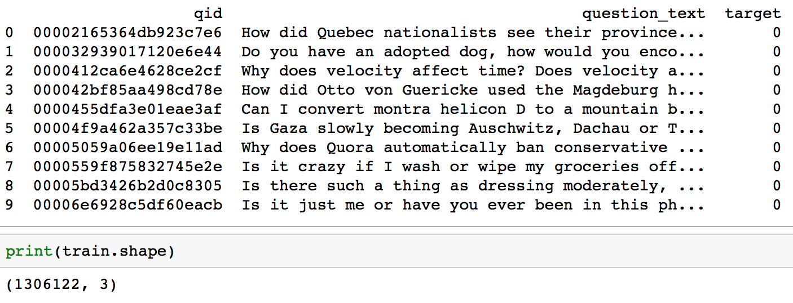

2. Data is heavily imbalanced: 94% of texts are non-toxic and 6% are toxic.

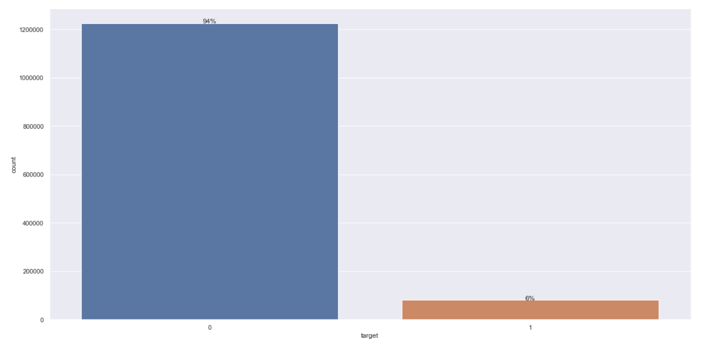

3. Sincere questions are more about technology, material life, emotional need; Insincere questions are more about race, religion, politics.

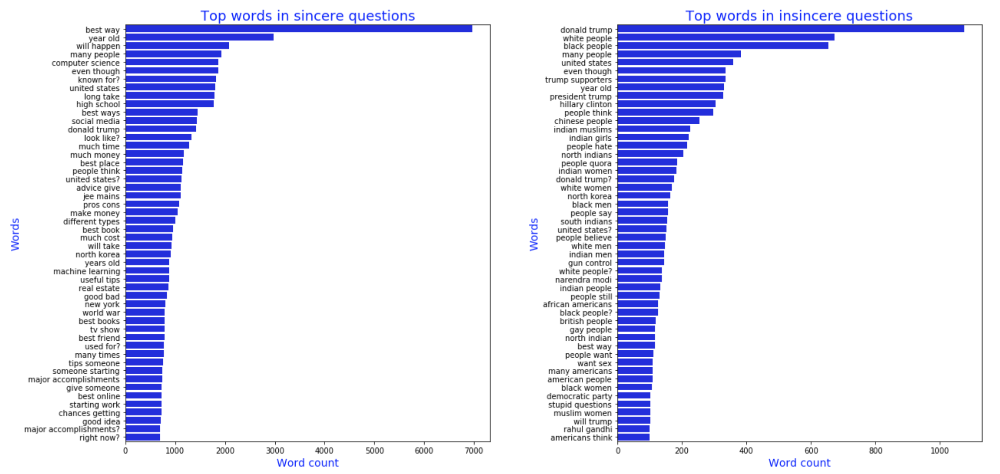

## Logistic Regression Classifier:
We choose TF-IDF as text feature and transfer all text into vectors. Then we used logistic regression model to classify the question whether it is sincere or not. After we get prediction, we made a ROC curve in order to show the AUC score and also calculated precission. Both of them are methods to evaluate this model. The two scores are high which means this model perform well. 

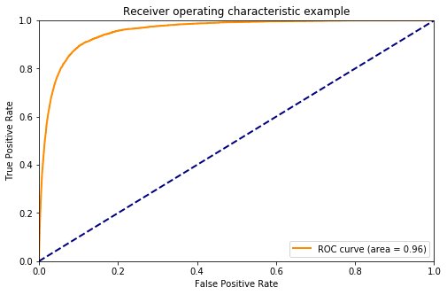

However, our dataset is unbalanced, which will influence the accuracy of AUC score and precision. Thus, we choose F1 score as a new method to evaluate this mode. Contrary to earlier results, F1 score is only 0.63. This result shows that logistic regression is not so good.

## Neural NetworkClassifier 

### Embeddings and Preprocessing

#### Pre-trained Word Embeddings Useful for Neural Network Model
    a. Embedding
    Word embeddings are a type of word representation that allows words with similar meaning to have a similar representation.
    Pretrained word embeddings have proven to be invaluable for improving performance in natural language analysis tasks,
    which often suffer from paucity of data.
    
    b. oov 
    words that we can use to improve our preprocessing.
    
    c.unk
    unknown words

#### Data Preprocessing 
    a. Baseline:
    Don't use standard preprocessing steps like stemming or stop word removal when you have pre-trained embeddings.
    
    b. Reason:
    Lose valuable information, which would help your NN to figure things out.
    
    c. Purpose:
    Get your vocabulary as close to the embeddings as possible.

#### GoogleNews pretrained embeddings example
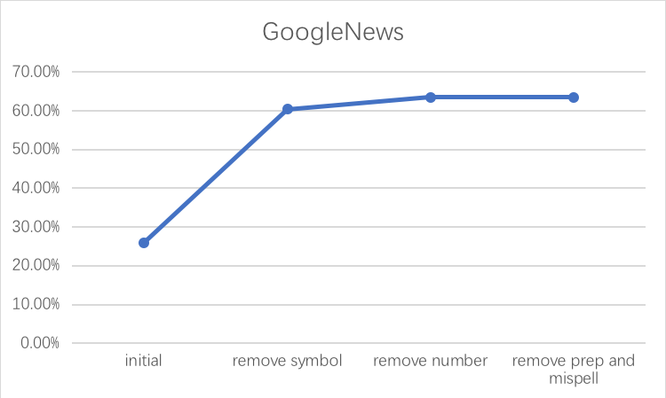

####  Compare Four different embeddings coverage
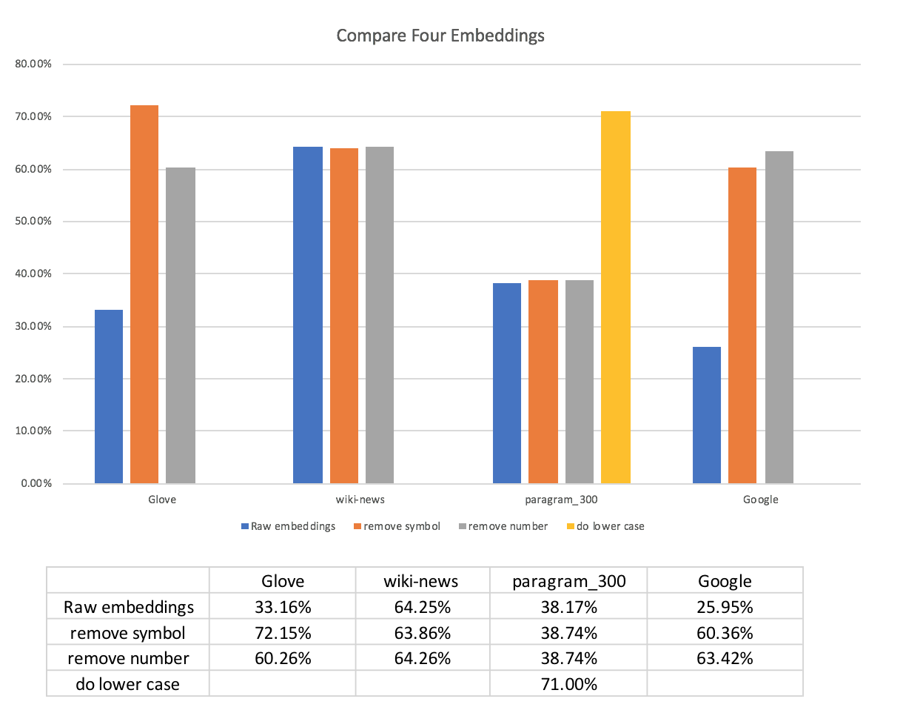

#### Preparations
    Fill in missing value by “_na_”
    Tokenize
    Padding(fix length or variable length)
    Embedding Matrix
    
#### Different embeddings performance
    Though we trained an embedding based on our dataset so that it covers all of the words, the performance is still not good.
    Pre-trained Embeddings was trained from millions of dataset so it is good enough to represent the meaning of the words.  

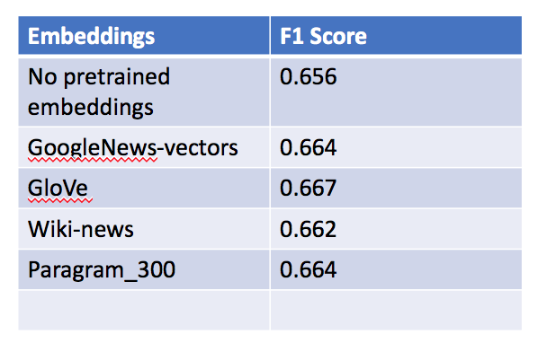

#### Without & With Preprocessing performance
    Though more words are not covered and replaced by “UNK” , BiGRU model is still powerful to do classification.
     Before: 0.669
    Found embeddings for 24.31% of vocab
    Found embeddings for  78.75% of all text

     After: 0.664
    Found embeddings for 60.42% of vocab 
    Found embeddings for 97.31% of all text

### Models

#### 2-layer BiGRU
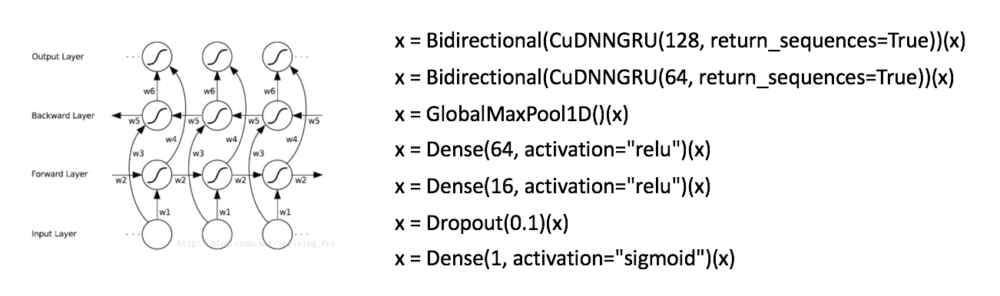

#### LSTM+CNN
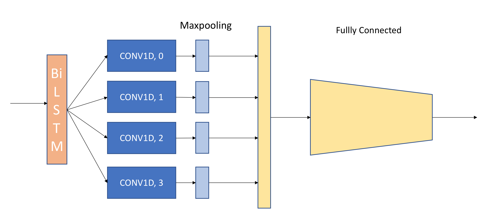

#### GRU+Attention
    * 3-layer-BiGRU
    Initializer: Glorot Uniform
    recurrent_initializer=Orthogonal
    * Concatenate: 
    Maxpooling
    Last Hidden Sate
    Attention
    * Fully-connected Layer
    BatchNormalization
    Dropout
    
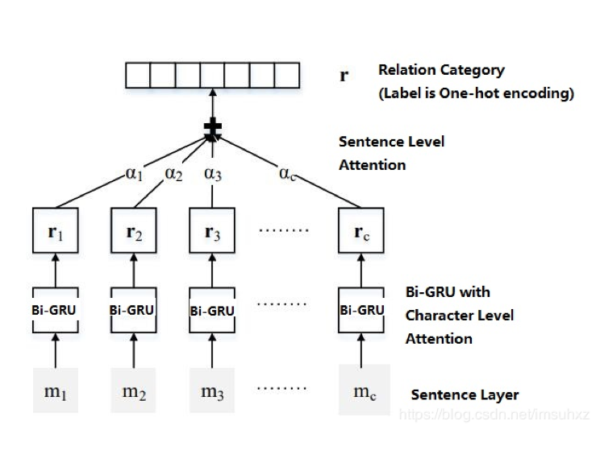

### Different model performance
    Since the data is imbalacenced, 94% are the sincere target, so accuracy for four models are both high, but through the F1 score, could find the LR model is not good.

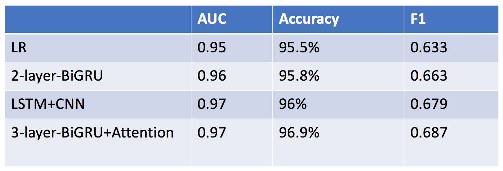

## conclusion

### Comparaed to LR Model

    These texts are correctly predicted by this DL model
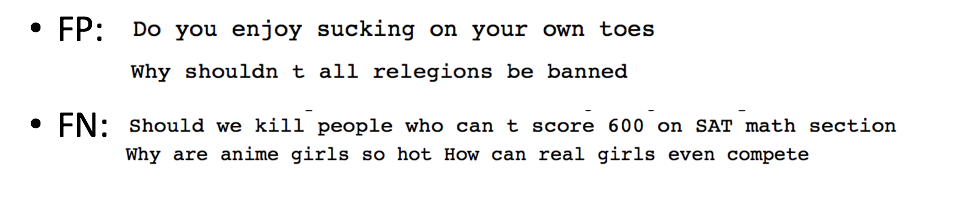

 

### Further work
    These texts are those our model still misclassifies.
    
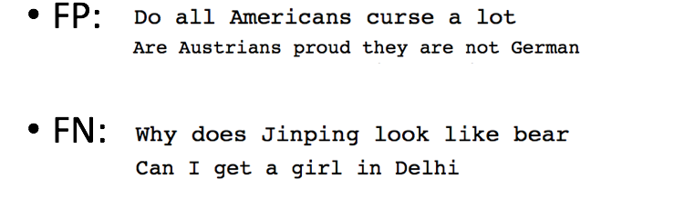

#### Reference:
##### Data:
    https://www.kaggle.com/c/quora-insincere-questions-classification/data

