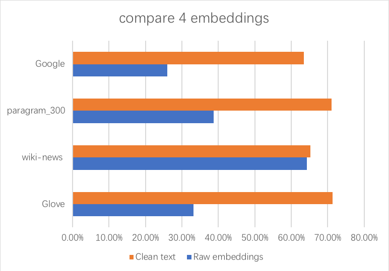

# DS595 IR  Final project README.

## Problem discreption:

## LR:

## Neutral Network:

### Data cleaning:

#### 1. Pre-trained Word Embeddings Useful for Neural Network Model
    a. Embedding
    Word embeddings are a type of word representation that allows words with similar meaning to have a similar representation.
    Pretrained word embeddings have proven to be invaluable for improving performance in natural language analysis tasks,
    which often suffer from paucity of data.
    
    b. oov 
    words that we can use to improve our preprocessing.
    
    c.unk
    unknown words

#### 2. Data Preprocessing 
    a. Baseline:
    Don't use standard preprocessing steps like stemming or stop word removal when you have pre-trained embeddings.
    
    b. Reason:
    Lose valuable information, which would help your NN to figure things out.
    
    c. Purpose:
    Get your vocabulary as close to the embeddings as possible.

#### 3. GoogleNews pretrained embeddings example:

#### 4. Compare Four different embeddings:

